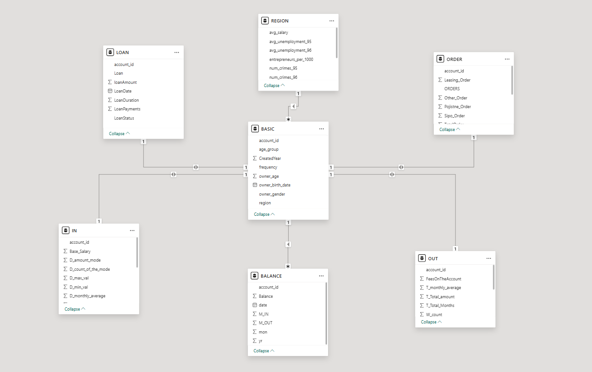
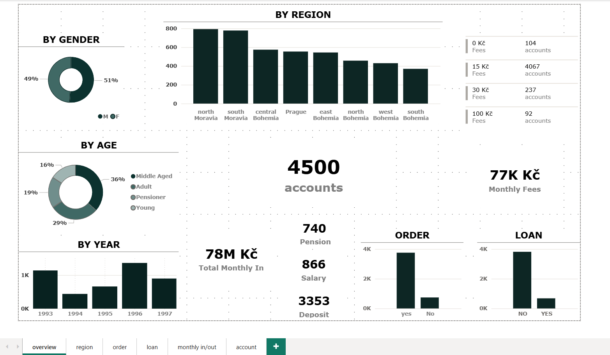

# Berka Database — Modeling & Analyzing

A complete analysis of the Berka database — a real banking dataset — modeled it, 
and built a 7-page interactive dashboard that represents the bank as a 
complete system, from which clear insights were extracted.

The analysis moves from raw database to business insight: connecting to 
a live academic server, engineering the data through SQL, building a 
complete Power BI model centered on the account entity, and visualizing 
the bank across 7 interactive dashboard pages.

---

---

---

## Project Files

* [SQL Script](https://github.com/aliabedalkereem-byte/Data-Analytics-Portfolio/tree/main/4_Berka-Database-Analysis/Berka_SQL_Script.sql)
* [CSV Files](https://github.com/aliabedalkereem-byte/Data-Analytics-Portfolio/tree/main/4_Berka-Database-Analysis/CSV_Files)
* [Dashboard](https://github.com/aliabedalkereem-byte/Data-Analytics-Portfolio/tree/main/4_Berka-Database-Analysis/Berka_Project_Dashboard.pbix)
* [Report](https://github.com/aliabedalkereem-byte/Data-Analytics-Portfolio/tree/main/4_Berka-Database-Analysis/Berka_Project_Report.pdf)
