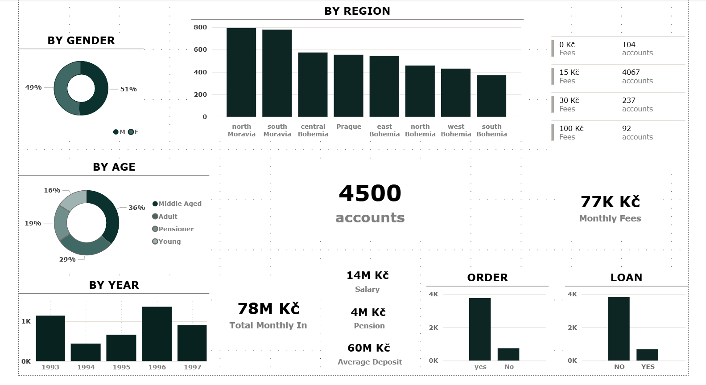
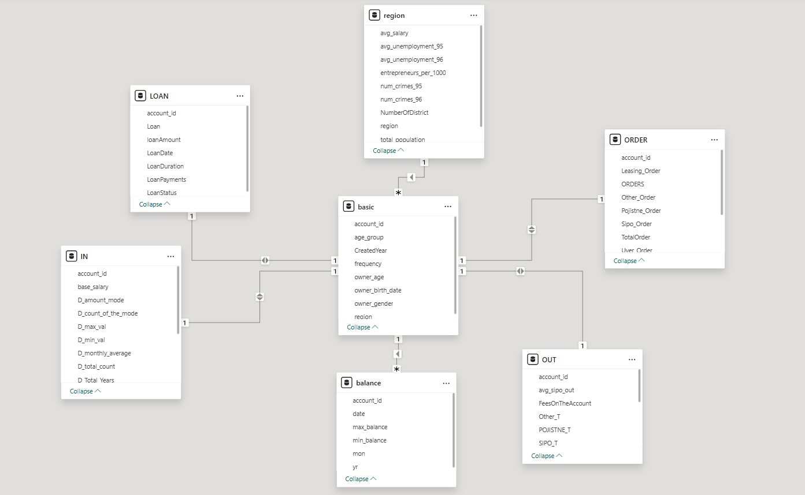

# Berka Database — Modeling & Analyzing

A complete business analysis of the Berka relational banking database. 
This project models the bank as an integrated system — identifying the 
core variables, understanding the relationships between them, and 
extracting clear insights from the data.

The analysis moves from raw database to business insight: connecting to 
a live academic server, engineering the data through SQL, building a 
complete Power BI model centered on the account entity, and visualizing 
the bank across 7 interactive dashboard pages.

## Project Files

[SQL Script](SQL_Script.sql) 
[CSV Files](CSV_Files/) 
[Dashboard](Project_Dashboard.pbix) 
[Report](Project_Report.docx) 
